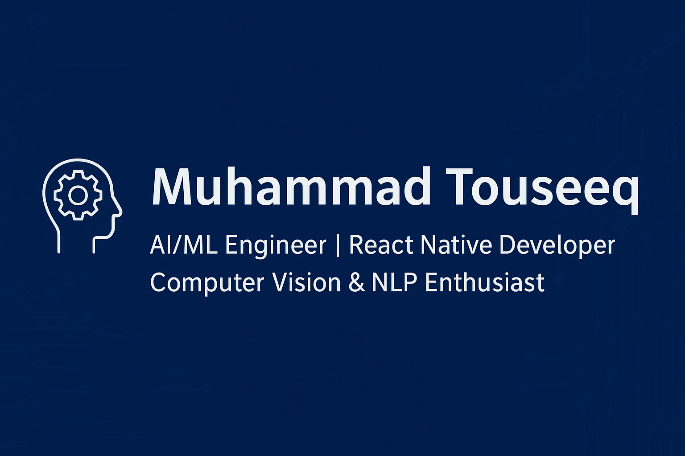

<!-- Banner -->

   

# Hi 👋, I'm Muhammad Touseeq                                                                  

  

---

## 🚀 About Me
🎓 **BSCS (AI Specialization, 2021-2025)** : PMAS Arid Agriculture University, Rawalpindi  
💡 Passionate about **AI/ML, Computer Vision, NLP, and Mobile Development**  
🔬 Experienced in **end-to-end ML pipelines**: data annotation -> model training -> deployment  
📱 Skilled in **React Native** for AI-powered mobile applications  
🌍 Open to **collaborations, internships, and AI research projects**  

---

## 🎓 Education
- **BS Computer Science (AI Specialization)** : PMAS Arid Agriculture University, Rawalpindi (2021 - 2025)  
- **F.Sc. Pre-Engineering** : Steps College, Rawalpindi (2019 - 2021)  
- **Matriculation** : Aisha Lasani Model High School, Rawalpindi (2019)  

---

## 💼 Experience
- 🖥️ **Junior AI Engineer (Remote Intern)** : CareCloud-MTBC (Jun 2025 - Sept 2025)  
- 🤖 **Machine Learning Intern (Remote)** : CodSoft (May 2024 - Jun 2024)  

---

## 🛠️ Tech Stack

### 🚀 Languages

### 🤖 AI & ML

### 📱 Mobile & Web

### 🗄️ Databases

---

## 📂 Featured Projects

### 🌟 Latest: Football Analysis Suite (AI/ML)
- ⚽ **[Goal Detection System](https://github.com/Touseeq20/football-goal-detection)** : Real-time ball trajectory and goal net segmentation using YOLOv8.
- 👤 **[Player Face Recognition](https://github.com/Touseeq20/player-face-recognition)** : State-of-the-art identification using ArcFace embeddings.
- 👕 **[Jersey Number OCR](https://github.com/Touseeq20/jersey-number-detection)** : Robust tracking linking player IDs with recognized jersey numbers.
- 🦅 **[Combined Match Analyzer](https://github.com/Touseeq20/football-match-analyzer)** : Unified analytics platform for goals, fouls, and player tracking.

### 📱 React Native Mobile Apps
- ⚽ **Football Match Summary Generator** : Detects events, identifies players, and generates highlights.
- 📖 **Daily Quran Ayat Reciter** : AI mood prediction app for personalized Quranic verses.

### 🌐 Web & AI
- 🤖 **RAG Document Chatbot** : Streamlit + FAISS integrated with OpenAI and DeepSeek APIs.
- 🧑‍💻 **Face Recognition Attendance** : Automated system developed using Python and OpenCV.

---

---

## 📊 GitHub Analytics

---
---

## 🌐 Live Portfolio  
👉 [Explore My Work](https://touseeq20.github.io/MyPortfolio/)  

---

## 📫 Connect With Me

---

## 👀 Profile Views

---

⭐ **Thanks for Visiting!**  
Let's collaborate on building the next generation of AI solutions! 🚀
